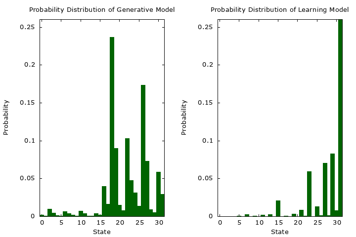

# RBM
制限ボルツマンマシン(restricted Boltzmann machine, RBM)のリポジトリ

# RBMの学習過程の可視化
RBMの学習過程を可視化するために、可視変数の状態を2進数として一次元の確率分布として表現しています。可視変数の数が少ない場合、状態数が少ないため、各状態の確率 ( P(v) ) をグラフ化することが可能です。

学習の各エポックごとにこの確率分布を保存し、最終的にそれらを結合してGIF画像として出力します。このGIF画像を通じて、学習モデルの確率分布がどのように変化し、生成モデルの確率分布に近づいていくかを視覚的に確認することができます。

この可視化により、学習の進行状況やモデルの収束具合を直感的に理解することができます。




# ファイル構成
- rbm.h：RBMクラスのヘッダファイル
- rbm.cpp：RBMクラスのメンバ関数の実装が書いてあるファイル
- main.cpp：RBMのサンプリングを実行するプログラムが書いてあるファイル
- learn.cpp：RBMの学習を実行するプログラムが書いてあるファイル
- learn-sampling.cpp：RBMの学習をPCD法で行うプログラムが書いてあるファイル
- paramGen.cpp：パラメーター値をファイルに出力するプログラムが書いてあるファイル
- paramRead.cpp：パラメーター値をファイルから入力するプログラムが書いてあるファイル
- Makefile：makeコマンドを使えるようにするファイル
- plt：gnuplotのスクリプト用のディレクトリ
    - graph.plt：main.cpp用のgnuplotのスクリプト
    - learn.plt：learn.cpp用のgnuplotのスクリプト
    - learn-anime.plt：学習のアニメーションを行うgnuplotのスクリプト
    - learn-anime-sampling.plt：学習のアニメーションを行うgnuplotのスクリプト
    - paramGen.plt：paramGen.cpp用のgnuplotのスクリプト
    - paramRead.plt：paramRead.cpp用のgnuplotのスクリプト

# 実行方法

## コンパイル方法
以下のコマンドを実行すると実行ファイルが作成される
```shell
make
```

## サンプリングの実行
サンプリングの実行結果を表示する. `graph/graph.pdf`が生成される. 
```shell
./main
gnuplot ./plt/graph.plt
```

## 学習の実行
学習を実行する. `graph/learn.pdf`が生成される. 
```shell
./learn
gnuplot ./plt/learn.plt
```

## 学習のアニメーション
`learn.cpp`のrbm1, rbm2の`AnimeteType`を`anime`に設定する. 
```c++
int main(void){
    int n_v = 5; // 可視ユニットの数
    int num = 1000; // 訓練データの数
    int epoch = 200; // 学習のエポック数
    RBM rbm1(n_v, 10); // 生成モデルのRBM
    RBM rbm2(n_v, 50); // 学習モデルのRBM
    rbm2.setTrainType(RBM::TrainType::sampling);
    rbm1.setAnimeteType(RBM::AnimeteType::anime);
    rbm2.setAnimeteType(RBM::AnimeteType::anime);
    rbm2.setGradientType(RBM::GradientType::nomal);
```

以下コマンドを実行する。
```shell
./learn
gnuplot ./plt/learn-anime.plt
```
`graph/learn-anime.gif`が生成される. 

# 注意点
VL-PGothicというフォントがないとpdfの出力結果がおかしくなる
